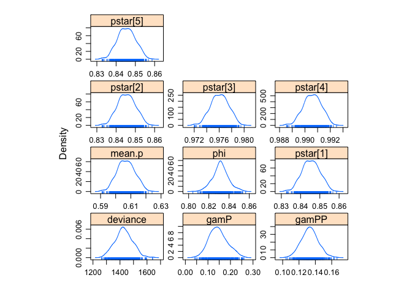
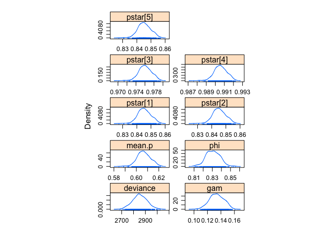

# Bayesian implementation of capture-recapture models with robust design

## Motivation

I am currently involved in the [estimation of the population size of the brown bear population in the Pyrenees](https://www.biorxiv.org/content/10.1101/075663v1). So far, we have been using a frequentist capture-recapture approach using the robust design. Because it is a small population, I'm interested in implementing a Bayesian approach. To do so, Thomas Riecke and colleagues have proposed [a parameterization and some BUGS code](https://besjournals.onlinelibrary.wiley.com/doi/abs/10.1111/2041-210X.13065) to fit robust-design capture-recapture methods. Here, I am using the code they made available, tweaking it a bit and making it generic. Also, I provide a fully reproducible example. For more details about the robust design, check out [the dedicated chapter](http://www.phidot.org/software/mark/docs/book/pdf/chap15.pdf) in the Gentle Introduction to Mark. For extension of the Riecke's model to Jolly-Seber models, see [here](https://esajournals.onlinelibrary.wiley.com/doi/full/10.1002/ecs2.2334), and for an alternative Bayesian implementation of the robust design, check out the work by Robert Rankin and colleagues [there](https://www.frontiersin.org/articles/10.3389/fmars.2016.00025/full).

## Frequentist approach

I will use a robust design example data set that comes with program `MARK`, check out `?RMark::robust`. 

First, we load the packages we will need in this section:

```r
library(RMark)
library(tidyverse)
```

### Data

Then we load the data

```r
data(robust)
head(robust)
```

```
##                ch freq
## 1 000000111011101    1
## 2 000000111111000    1
## 3 000001000000000    2
## 4 000001001110100    1
## 5 000001010000000    1
## 6 000001100000010    1
```

We need to define the time intervals: 

```r
time.intervals <- c(0, 1,            # primary occasion 1, 2 secondary occasions
                    0, 1,            # primary occasion 2, 2 secondary occasions
                    0, 0, 0, 1,      # primary occasion 3, 4 secondary occasions
                    0, 0, 0, 0, 1,   # primary occasion 4, 5 secondary occasions
                    0)               # primary occasion 5, 2 secondary occasions
```

### Random emigration

We fit a model with constant survival, constant detection and **random temporary emigration**:

```r
p.dot <- list(formula=~1, share = TRUE)
S.dot <- list(formula=~1)
GammaDoublePrime.dot <- list(formula=~1, 
                                share = TRUE)
model.1 <- mark(data = robust, 
                model = "Robust",
                time.intervals = time.intervals,
                model.parameters = list(S = S.dot,
                                        GammaDoublePrime = GammaDoublePrime.dot,
                                        p = p.dot),
                threads=2,
                output = FALSE)
```

Print the parameter estimates:

```r
model.1$results$real
```

```
##                        estimate         se         lcl         ucl fixed
## S g1 c1 a0 t1         0.8312500  0.0079641   0.8150602   0.8462897      
## Gamma'' g1 c1 a0 t1   0.1336015  0.0109793   0.1135085   0.1566228      
## p g1 s1 t1            0.6064105  0.0059031   0.5947827   0.6179190      
## f0 g1 a0 s1 t0      163.3785700 15.0915830 136.3746200 195.7296700      
## f0 g1 a0 s2 t0      125.0667300 12.9788300 102.1040500 153.1936000      
## f0 g1 a0 s3 t0       15.9713820  4.2317023   9.5856695  26.6110840      
## f0 g1 a0 s4 t0        4.2875764  2.2322650   1.6418392  11.1967790      
## f0 g1 a0 s5 t0       52.8422130  8.1674652  39.1011790  71.4121550      
##                        note
## S g1 c1 a0 t1              
## Gamma'' g1 c1 a0 t1        
## p g1 s1 t1                 
## f0 g1 a0 s1 t0             
## f0 g1 a0 s2 t0             
## f0 g1 a0 s3 t0             
## f0 g1 a0 s4 t0             
## f0 g1 a0 s5 t0
```

and the population size estimates:

```r
model.1$results$derived$`N Population Size`
```

```
##    estimate       lcl       ucl
## 1 1057.3786 1030.3746 1089.7297
## 2  810.0667  787.1041  838.1936
## 3  685.9714  679.5857  696.6111
## 4  507.2876  504.6418  514.1968
## 5  343.8422  330.1012  362.4122
```

### Markovian emigration

We fit the same model with **Markovian temporary emigration** now:

```r
p.dot <- list(formula=~1, share = TRUE)
S.dot <- list(formula=~1)
GammaDoublePrime.dot <- list(formula=~1)
GammaPrime.dot <- list(formula=~1)
model.2 <- mark(data = robust, 
                model = "Robust",
                time.intervals = time.intervals,
                model.parameters = list(S = S.dot,
                                        GammaPrime = GammaPrime.dot,
                                        GammaDoublePrime = GammaDoublePrime.dot,
                                        p = p.dot),
                threads=2,
                output = FALSE)
```

Print the parameter estimates:

```r
model.2$results$real
```

```
##                        estimate         se         lcl         ucl fixed
## S g1 c1 a0 t1         0.8308413  0.0082652   0.8140186   0.8464294      
## Gamma'' g1 c1 a0 t1   0.1335610  0.0109476   0.1135226   0.1565119      
## Gamma' g1 c1 a1 t2    0.1246823  0.0513209   0.0536314   0.2636393      
## p g1 s1 t1            0.6064240  0.0059038   0.5947949   0.6179338      
## f0 g1 a0 s1 t0      163.3651400 15.0911060 136.3621600 195.7153600      
## f0 g1 a0 s2 t0      125.0566200 12.9783840 102.0948400 153.1826500      
## f0 g1 a0 s3 t0       15.9690640  4.2314181   9.5839088  26.6082450      
## f0 g1 a0 s4 t0        4.2867419  2.2320757   1.6413658  11.1956500      
## f0 g1 a0 s5 t0       52.8378900  8.1671244  39.0975140  71.4071650      
##                        note
## S g1 c1 a0 t1              
## Gamma'' g1 c1 a0 t1        
## Gamma' g1 c1 a1 t2         
## p g1 s1 t1                 
## f0 g1 a0 s1 t0             
## f0 g1 a0 s2 t0             
## f0 g1 a0 s3 t0             
## f0 g1 a0 s4 t0             
## f0 g1 a0 s5 t0
```

and the population size estimates:

```r
model.2$results$derived$`N Population Size`
```

```
##    estimate       lcl       ucl
## 1 1057.3651 1030.3622 1089.7154
## 2  810.0566  787.0948  838.1827
## 3  685.9691  679.5839  696.6082
## 4  507.2867  504.6414  514.1956
## 5  343.8379  330.0975  362.4072
```

Now that we have our results with the frequentist approach, let's implement the Bayesian approach and compare the estimates.

## Bayesian approach 

### Data

First, we separate the columns of the capture-recapture dataset:

```r
chx <- NULL
for (i in 1:nrow(robust)){
  chx <- rbind(chx, unlist(str_split(robust$ch[i],'')))
}
head(chx)
```

```
##      [,1] [,2] [,3] [,4] [,5] [,6] [,7] [,8] [,9] [,10] [,11] [,12] [,13] [,14]
## [1,] "0"  "0"  "0"  "0"  "0"  "0"  "1"  "1"  "1"  "0"   "1"   "1"   "1"   "0"  
## [2,] "0"  "0"  "0"  "0"  "0"  "0"  "1"  "1"  "1"  "1"   "1"   "1"   "0"   "0"  
## [3,] "0"  "0"  "0"  "0"  "0"  "1"  "0"  "0"  "0"  "0"   "0"   "0"   "0"   "0"  
## [4,] "0"  "0"  "0"  "0"  "0"  "1"  "0"  "0"  "1"  "1"   "1"   "0"   "1"   "0"  
## [5,] "0"  "0"  "0"  "0"  "0"  "1"  "0"  "1"  "0"  "0"   "0"   "0"   "0"   "0"  
## [6,] "0"  "0"  "0"  "0"  "0"  "1"  "1"  "0"  "0"  "0"   "0"   "0"   "0"   "1"  
##      [,15]
## [1,] "1"  
## [2,] "0"  
## [3,] "0"  
## [4,] "0"  
## [5,] "0"  
## [6,] "0"
```

Now we need to duplicate the encounter histories for which there more than one individual with that partcular history:

```r
encounter <- NULL 
for (i in 1:length(robust$freq)){
  if (robust$freq[i] == 1) encounter <- rbind(encounter, as.numeric(chx[i,]))
  if (robust$freq[i] > 1) encounter <- rbind(encounter, matrix(rep(as.numeric(chx[i,]), robust$freq[i]), nrow = robust$freq[i], byrow= T))
}
head(encounter)
```

```
##      [,1] [,2] [,3] [,4] [,5] [,6] [,7] [,8] [,9] [,10] [,11] [,12] [,13] [,14]
## [1,]    0    0    0    0    0    0    1    1    1     0     1     1     1     0
## [2,]    0    0    0    0    0    0    1    1    1     1     1     1     0     0
## [3,]    0    0    0    0    0    1    0    0    0     0     0     0     0     0
## [4,]    0    0    0    0    0    1    0    0    0     0     0     0     0     0
## [5,]    0    0    0    0    0    1    0    0    1     1     1     0     1     0
## [6,]    0    0    0    0    0    1    0    1    0     0     0     0     0     0
##      [,15]
## [1,]     1
## [2,]     0
## [3,]     0
## [4,]     0
## [5,]     0
## [6,]     0
```

We compute several quantities that we will need:

```r
n.ind <- nrow(encounter) # number of individuals
n.secondary <- c(2, 2, 4, 5, 2) # number of secondary occasions per primary occasion
n.primary <- length(n.secondary) # number of primary occasions
index <- list(1:2,
              3:4,
              5:8,
              9:13,
              14:15) # the secondary occasions
```

We calculate the number of individuals caught in each primary occasion, which we will need to get an estimate of population size:

```r
caught <- rep(NA, n.primary)
for (i in 1:n.primary){
  tmp <- encounter[,index[[i]]]
  caught[i] <- nrow(tmp[rowSums(tmp)!=0,])
}
caught
```

```
## [1] 894 685 670 503 291
```

We format the data as an array with dimensions the number of individuals times the number of primary occasions times the number of secondary occasions: 

```r
obs <- array(NA, dim = c(n.ind, n.primary, max(n.secondary)))
for (i in 1:n.primary){
    obs[,i,1:n.secondary[i]] <- encounter[,index[[i]]]
}
dim(obs)
```

```
## [1] 991   5   5
```

Now we format the data as required in the Bayesian implementation of the robust design:

```r
ch <- matrix(NA, n.ind, n.primary)
for (i in 1:n.ind){
  for (t in 1:n.primary){
    ifelse(any(obs[i,t,1:n.secondary[t]] == 1), ch[i,t] <- 1, ch[i,t] <- 2)
  }
}
```

We summarize detections by primary and secondary occasions:

```r
test <- matrix(NA, n.ind, n.primary)
for (i in 1:nrow(test)){
  for (j in 1:ncol(test)){
    test[i,j] <- sum(obs[i,j,], na.rm = TRUE)
  }
}

seen <- array(NA, c(n.ind, n.primary, max(n.secondary)))
missed <- array(NA, c(n.ind, n.primary, max(n.secondary)))

for (i in 1:nrow(test)){
  for (t in 1:ncol(test)){
    for (j in 1:n.secondary[t]){
      if(test[i,t] > 1 & obs[i,t,j] == 1){seen[i,t,j] <- 1}
      if(test[i,t] >= 1 & obs[i,t,j] == 0){missed[i,t,j] <- 1}
    }
  }
}

yes <- matrix(NA, n.primary, max(n.secondary))
no <- matrix(NA, n.primary, max(n.secondary))

for (i in 1:nrow(yes)){
  for (j in 1:ncol(yes)){
    yes[i,j] <- sum(seen[,i,j], na.rm = TRUE)
    no[i,j] <- sum(missed[,i,j], na.rm = TRUE)
  }
}

total <- yes + no
total
```

```
##      [,1] [,2] [,3] [,4] [,5]
## [1,]  649  690    0    0    0
## [2,]  466  509    0    0    0
## [3,]  652  628  644  652    0
## [4,]  497  501  491  494  499
## [5,]  187  195    0    0    0
```

Get first occasions of capture:

```r
get.first <- function(x)min(which (x != 2))
first <- apply(ch,1,get.first); first[first == "Inf"] <- NA
```

Cut individuals released in last primary occasion:

```r
ch <- subset(ch, first != n.primary)
first <- subset(first, first != n.primary)
```

Define initial values for the latent states:

```r
z.init <- matrix(NA, nrow(ch), ncol(ch))
for (i in 1:nrow(ch)){
  if(first[i] < ncol(z.init)){
    z.init[i,(first[i] + 1):ncol(z.init)] <- 1
  }
}
```

### Markovian emigration

Load the package we need to carry out Bayesian analyses:

```r
library(R2jags)
```

The code:

```r
model <- function() { 
    
    # priors
    phi ~ dunif(0,1)     # survival 
    gP ~ dunif(0,1)      # gamma'
    gPP ~ dunif(0,1)     # gamma'' 
    gamP <- 1 - gP       # MARK parameterization
    gamPP <- 1 - gPP     # MARK parameterization
    mean.p ~ dunif(0,1)  # detection
    
    # secondary occasions p's
    for (t in 1:n.years){
      for (j in 1:max(n.sec[1:n.years])){
        p[t,j] <- mean.p
      }
    }   

    for (t in 1:n.years){
      for (j in 1:n.sec[t]){
        yes[t,j] ~ dbin(p[t,j], total[t,j])
      }
    }   
    
    # Primary occasions p's or pooled detection probability
    for (t in 1:n.years){
      pstar[t] <- 1 - prod(1 - p[t,1:n.sec[t]])
    }
    
    # state matrices
    s[1,1] <- phi * gPP
    s[1,2] <- phi * (1 - gPP)
    s[1,3] <- 1 - phi
    s[2,1] <- phi * gP
    s[2,2] <- phi * (1 - gP)
    s[2,3] <- 1 - phi
    s[3,1] <- 0
    s[3,2] <- 0
    s[3,3] <- 1

    # observation matrices
    for (t in 1:n.years){
      o[1,t,1] <- pstar[t]
      o[1,t,2] <- 1 - pstar[t]
      o[2,t,1] <- 0
      o[2,t,2] <- 1
      o[3,t,1] <- 0
      o[3,t,2] <- 1
    }

    # likelihood
    for (i in 1:n.ind){
      z[i,first[i]] <- ch[i,first[i]]
      for (t in (first[i]+1):n.years){
        z[i,t] ~ dcat(s[z[i,t-1], ])   # state equations
        ch[i,t] ~ dcat(o[z[i,t], t, ]) # obsevation equations
      } 
    }
    
}
```

Build the list of data

```r
dat <- list(first = first, 
            ch = ch, 
            n.sec = n.secondary, 
            n.years = ncol(ch), 
            n.ind = nrow(ch),
            yes = yes, 
            total = total)
```

The initial values:

```r
inits <- function(){list(z = z.init)}
```

Define the parameters we'd like to monitor:

```r
pars <- c('pstar','mean.p','phi','gamP','gamPP')
```

The MCMC settings (number of iterations for burnin and post-inference probably need to be increased):

```r
n.chains <- 1
n.iter <- 1000
n.burnin <- 500
```

And run the model:

```r
res_markovian <- jags(data = dat, 
             inits = inits, 
             parameters.to.save = pars, 
             model.file = model, 
             n.chains = n.chains,
             n.iter = n.iter, 
             n.burnin = n.burnin)
```

```
## Compiling model graph
##    Resolving undeclared variables
##    Allocating nodes
## Graph information:
##    Observed stochastic nodes: 3865
##    Unobserved stochastic nodes: 3854
##    Total graph size: 16615
## 
## Initializing model
```

Posterior density distribution of the parameters:

```r
library(lattice)
jagsfit.mcmc <- as.mcmc(res_markovian)
densityplot(jagsfit.mcmc)
```

<!-- -->

Display the results:

```r
summary(jagsfit.mcmc)
```

```
## 
## Iterations = 501:1000
## Thinning interval = 1 
## Number of chains = 1 
## Sample size per chain = 500 
## 
## 1. Empirical mean and standard deviation for each variable,
##    plus standard error of the mean:
## 
##               Mean        SD  Naive SE Time-series SE
## deviance 1428.3359 6.463e+01 2.890e+00      5.188e+00
## gamP        0.1461 4.070e-02 1.820e-03      4.874e-03
## gamPP       0.1332 1.028e-02 4.598e-04      1.238e-03
## mean.p      0.6069 5.824e-03 2.604e-04      3.696e-04
## phi         0.8316 7.961e-03 3.560e-04      6.074e-04
## pstar[1]    0.8454 4.579e-03 2.048e-04      2.908e-04
## pstar[2]    0.8454 4.579e-03 2.048e-04      2.908e-04
## pstar[3]    0.9761 1.416e-03 6.334e-05      9.010e-05
## pstar[4]    0.9906 6.965e-04 3.115e-05      4.434e-05
## pstar[5]    0.8454 4.579e-03 2.048e-04      2.908e-04
## 
## 2. Quantiles for each variable:
## 
##               2.5%       25%       50%       75%     97.5%
## deviance 1304.4318 1387.9691 1426.5497 1468.3835 1549.2666
## gamP        0.0738    0.1171    0.1432    0.1724    0.2303
## gamPP       0.1136    0.1264    0.1332    0.1398    0.1538
## mean.p      0.5963    0.6029    0.6067    0.6109    0.6179
## phi         0.8156    0.8268    0.8315    0.8362    0.8488
## pstar[1]    0.8370    0.8423    0.8453    0.8486    0.8540
## pstar[2]    0.8370    0.8423    0.8453    0.8486    0.8540
## pstar[3]    0.9734    0.9751    0.9761    0.9771    0.9787
## pstar[4]    0.9893    0.9901    0.9906    0.9911    0.9919
## pstar[5]    0.8370    0.8423    0.8453    0.8486    0.8540
```

Provide posterior means for population size:

```r
Nmcmc <- matrix(NA, nrow(res_markovian$BUGSoutput$sims.list$pstar), n.primary)
for (i in 1:n.primary){
  Nmcmc[,i] <- caught[i] / res_markovian$BUGSoutput$sims.list$pstar[,i]
}
apply(Nmcmc,2,mean)
```

```
## [1] 1057.5016  810.2781  686.4191  507.7790  344.2203
```

If we compare to the frequentist results, we're pretty close I'd say. Now let's fit the model with random emigration.

### Random emigration

The code:

```r
model <- function() {
  
    # priors
    phi ~ dunif(0,1)     # survival  
    gamma ~ dunif(0,1)   # gamma
    gam <- 1 - gamma     # MARK parameterization
    mean.p ~ dunif(0,1)  # detection
    
    # secondary occasions p's
    for (t in 1:n.years){
      for (j in 1:max(n.sec[1:n.years])){
        p[t,j] <- mean.p
      }
    }

    for (t in 1:n.years){
      for (j in 1:n.sec[t]){
        yes[t,j] ~ dbin(p[t,j], total[t,j])
      }
    }   
    
    # primary occasions p's or pooled detection probability
    for (t in 1:n.years){
      pstar[t] <- 1 - prod(1 - p[t,1:n.sec[t]])
    }
    
    # likelihood

    for (i in 1:n.ind){
    z[i,first[i]] <- ch[i,first[i]]
      for (t in (first[i]+1):n.years){
        mu1[i,t] <- z[i,t-1] * phi
        mu2[i,t] <- z[i,t] * (gamma) * pstar[t]
        z[i,t] ~ dbern(mu1[i,t])  # state equations
        ch[i,t] ~ dbern(mu2[i,t]) # observation equations
      } 
    }
}
```

The data

```r
ch[ch == 2] <- 0 # Bernoulli likelihood
dat <- list(first = first, 
            ch = ch, 
            n.sec = n.secondary, 
            n.years = ncol(ch), 
            n.ind = nrow(ch),
            yes = yes, 
            total = total)
```

Then initial values, parameters to monitor, MCMC settings (number of iterations for burnin and post-inference probably need to be increased)

```r
inits <- function(){list(z = z.init)}  
pars <- c('pstar','mean.p','phi','gam')
n.chains <- 1
n.iter <- 1000
n.burnin <- 500
```

We are ready to fit the model to the data:

```r
res_random <- jags(data = dat, 
             inits = inits, 
             parameters.to.save = pars,
             model.file = model, 
             n.chains = n.chains,
             n.iter = n.iter, 
             n.burnin = n.burnin)
```

```
## Compiling model graph
##    Resolving undeclared variables
##    Allocating nodes
## Graph information:
##    Observed stochastic nodes: 3865
##    Unobserved stochastic nodes: 3853
##    Total graph size: 16589
## 
## Initializing model
```


Posterior density distribution of the parameters:

```r
jagsfit.mcmc <- as.mcmc(res_random)
densityplot(jagsfit.mcmc)
```

<!-- -->

Display the results:

```r
summary(jagsfit.mcmc)
```

```
## 
## Iterations = 501:1000
## Thinning interval = 1 
## Number of chains = 1 
## Sample size per chain = 500 
## 
## 1. Empirical mean and standard deviation for each variable,
##    plus standard error of the mean:
## 
##               Mean        SD  Naive SE Time-series SE
## deviance 2852.9690 6.053e+01 2.707e+00      5.769e+00
## gam         0.1337 1.058e-02 4.732e-04      8.440e-04
## mean.p      0.6067 5.880e-03 2.629e-04      3.259e-04
## phi         0.8308 7.525e-03 3.365e-04      4.952e-04
## pstar[1]    0.8453 4.627e-03 2.069e-04      2.566e-04
## pstar[2]    0.8453 4.627e-03 2.069e-04      2.566e-04
## pstar[3]    0.9760 1.435e-03 6.416e-05      7.958e-05
## pstar[4]    0.9906 7.065e-04 3.160e-05      3.920e-05
## pstar[5]    0.8453 4.627e-03 2.069e-04      2.566e-04
## 
## 2. Quantiles for each variable:
## 
##               2.5%       25%       50%       75%     97.5%
## deviance 2736.3198 2811.8658 2849.3106 2894.0071 2972.9760
## gam         0.1130    0.1265    0.1337    0.1415    0.1528
## mean.p      0.5961    0.6027    0.6065    0.6105    0.6176
## phi         0.8160    0.8253    0.8307    0.8362    0.8451
## pstar[1]    0.8369    0.8422    0.8451    0.8483    0.8538
## pstar[2]    0.8369    0.8422    0.8451    0.8483    0.8538
## pstar[3]    0.9734    0.9751    0.9760    0.9770    0.9786
## pstar[4]    0.9892    0.9901    0.9906    0.9910    0.9918
## pstar[5]    0.8369    0.8422    0.8451    0.8483    0.8538
```

Provide posterior means for population size:

```r
Nmcmc <- matrix(NA, nrow(res_random$BUGSoutput$sims.list$pstar), n.primary)
for (i in 1:n.primary){
  Nmcmc[,i] <- caught[i] / res_random$BUGSoutput$sims.list$pstar[,i]
}
apply(Nmcmc,2,mean)
```

```
## [1] 1057.6403  810.3843  686.4435  507.7878  344.2655
```

Again, pretty close. 
